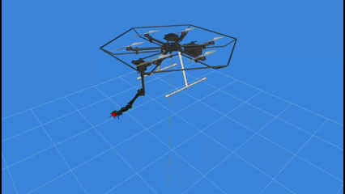

# Velocity-Level CLIK of UAMs

This is the code for a ROS2 controller node that computes the Closed-Loop Inverse Kinematics (CLIK) of the Unmanned Aerial Manipulator (UAM) of the Department of Industrial Engineering of University of Padova (UniPD). It works for ROS2 Humble (Ubuntu 22.04).

The UAM is composed by:
- A custom hexarotor platform assembled at DII with Tarot T960 frame. The UAV mounts a Pixhawk 6C autopilot with PX4 v1.15 installed.
- A commercial robotic arm: the Trossen WidowX250S Mobile.

<div align="center">
  
</div>

This code for now keeps the end-effector (EE) of the arm at the pose desired by the user. 

## Prerequisites

1) First you need to have followed all [the steps](https://docs.trossenrobotics.com/interbotix_xsarms_docs/ros_interface/ros2/software_setup.html#amd64-architecture) for having the `interbotix_ws` in your machine.

2. For the SITL simulation in [Gazebo Harmonic](https://docs.px4.io/main/en/sim_gazebo_gz/#gazebo-simulation) you will need to [clone the source code of the PX4-Autopilot](https://docs.px4.io/main/en/dev_setup/building_px4.html#building-px4-software). You will need also to copy the `t960a.sdf` files to the `~/PX4-Autopilot/Tools/simulation/gz/models` folders. Remember also to copy the `6006_gz_t960a` file in the folder `~/PX4-Autopilot/ROMFS/px4fmu_common/init.d-posix/airframes`.

3. For the dynamics and kinematics computations you will need to have [Pinocchio](https://gepettoweb.laas.fr/doc/stack-of-tasks/pinocchio/devel/doxygen-html/index.html) properly installed on your machine. For the intallation using ROS2 follow the steps at [this link](https://github.com/stack-of-tasks/pinocchio#ros). The main steps are

```bash
sudo apt install ros-$ROS_DISTRO-pinocchio
sudo apt-get install ros-${ROS_DISTRO}-kinematics-interface-pinocchio
```

## Installation

```bash
cd ~/interbotix_ws/src/interbotix_ros_manipulators/interbotix_ros_xsarms
git clone git@github.com:P3dr1x/clik1_node_pkg.git
cd ~/interbotix_ws
colcon build --packages-select clik1_node_pkg --symlink-install
```
Do not worry if some warnings on Pinocchio arise after the build. 

## Usage Guide

In the first terminal launch

```bash
ros2 launch clik1_node_pkg clik_sitl.launch.py
```

If you want also Rviz visualization in order to see the desired pose vs the actual one, in another terninal launch

```bash
ros2 launch clik1_node_pkg clik_uam_visual.launch.py
```

For running the controller 

```bash
ros2 run clik1_node_pkg clik_uam_node
```

Now the user will be asked to type the desired EE pose w.r.t. the current pose of the manipulator base. The user has to type 7 numbers (desired position + quaternion) 
If no or invalid input is given by the user, the desired relative EE pose commanded will be `{0.45 0.0 0.36 0 0 0 1}`.

> [!NOTE] 
> By default the node runs with the parameter `use_gazebo_pose:=true`. This means that the node will try to subscribe to the `/world/default/dynamic_pose/info` topic bridged from Gazebo to ROS2 for getting the UAV pose. 

<div align="center">
  
</div>

## Node parameters

Parameter      |Default value |   Description    |
|-------------------|---------------|------------|
| `use_gazebo_pose` | `true` | The node will try to subscribe to the `/world/default/dynamic_pose/info` topic bridged from Gazebo to ROS2 for getting the UAV pose. 
| `k_err_x_` | `10.0` | Is the gain value for the EE feedback 

## Mathematics

The algorithm computes in real-time the reference velocities to manipulators motors must have in order to keep the EE at the desired global pose. This is done through:

$$\dot{\mathbf{q}} = [\mathbf{J}_{\text{gen}}]^{\dagger}[\mathbf{K}]\mathbf{e}_x$$

where:

- $[\mathbf{J}_{\text{gen}}]$ is the **Generalized Jacobian matrix**.
- $[\mathbf{K}]$ is the gain matrix. For now is simply `k_err_x_*Identity(6,6)`.
- $\mathbf{e}_x$ is EE pose error vector. It is computed as $\mathbf{e}_x = \log_{se(3)}([\mathbf{T}_{w,e}]_{des}[\mathbf{T}_{w,e}]^{-1})$.

For more info check the papers (please consider citing):

- [Pasetto, A.; Vyas, Y.; Cocuzza, S. Zero Reaction Torque Trajectory Tracking of an Aerial Manipulator through Extended Generalized Jacobian. Appl. Sci. 2022, 12, 12254](https://doi.org/10.3390/app122312254)

- [Pedrocco, M.; Pasetto, A.; Fanti, G.; Benato, A.; Cocuzza, S. Trajectory Tracking Control of an Aerial Manipulator in the Presence of Disturbances and Model Uncertainties. Appl. Sci. 2024, 14, 2512](https://doi.org/10.3390/app14062512)