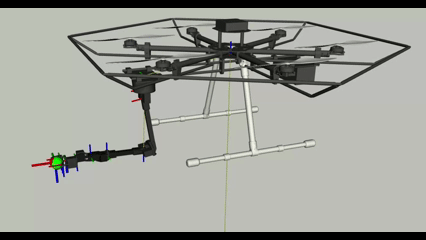

# Velocity-Level CLIK of UAMs

This is the code of a ROS2 controller node for the Unmanned Aerial Manipulator (UAM) of the Department of Industrial Engineering of University of Padova (UniPD). It works for ROS2 Humble (Ubuntu 22.04).

The UAM is composed by:
- A custom hexarotor platform assembled at DII with Tarot T960 frame. The UAV mounts a Pixhawk 6C autopilot with PX4 v1.15.2 installed.
- A commercial robotic arm: the Trossen WidowX250S Mobile.

<div align="center">
  
</div>

## Prerequisites

1) First you need to have followed all [the steps](https://docs.trossenrobotics.com/interbotix_xsarms_docs/ros_interface/ros2/software_setup.html#amd64-architecture) for having the `interbotix_ws` in your machine.

2. For the SITL simulation in [Gazebo Harmonic](https://docs.px4.io/main/en/sim_gazebo_gz/#gazebo-simulation) you will need to [clone the source code of the PX4-Autopilot](https://docs.px4.io/main/en/dev_setup/building_px4.html#building-px4-software). You will need also to copy the `t960a.sdf` files to the `~/PX4-Autopilot/Tools/simulation/gz/models` folders. Remember also to copy the `6006_gz_t960a` file in the folder `~/PX4-Autopilot/ROMFS/px4fmu_common/init.d-posix/airframes`.

3. For the dynamics and kinematics computations you will need to have [Pinocchio](https://gepettoweb.laas.fr/doc/stack-of-tasks/pinocchio/devel/doxygen-html/index.html) properly installed on your machine. For the intallation using ROS2 follow the steps at [this link](https://github.com/stack-of-tasks/pinocchio#ros). The main steps are

```bash
sudo apt install ros-$ROS_DISTRO-pinocchio
sudo apt-get install ros-${ROS_DISTRO}-kinematics-interface-pinocchio
```

4. You need also to have a **QP solver** installed on your system. Here [OSQP](https://osqp.org/) was chosen. In order to install it follow [the instructions in the doc](https://osqp.org/docs/release-0.6.3/get_started/sources.html). At the moment only [v0.6.3](https://github.com/osqp/osqp/tree/v0.6.3) works. So be sure to build the right version:

```bash
git clone --recursive https://github.com/osqp/osqp
git checkout v0.6.3
```
5. Then you need to install the **C++ wrapper for OSQP**. Follow the instructions at [this link](https://github.com/gbionics/osqp-eigen#%EF%B8%8F-build-from-source-advanced).

## Installation

```bash
cd ~/interbotix_ws/src/interbotix_ros_manipulators/interbotix_ros_xsarms
git clone git@github.com:P3dr1x/clik1_node_pkg.git
cd ~/interbotix_ws
colcon build --packages-select clik1_node_pkg --symlink-install
```
Do not worry if some warnings on Pinocchio arise after the build. 

## Usage with PX4 SITL simulation

In the first terminal launch

```bash
ros2 launch clik1_node_pkg clik_sitl.launch.py
```
If you want to subscribe to the simulated signals coming from PX4 for getting drone pose use `ros2 launch clik1_node_pkg clik_sitl.launch.py real_system:=true`. Pose data are taken from the `/real_t960a_pose` topic.

> [!NOTE] 
> Be sure that PX4 topics are exposed to ROS2. If in SITL simulation run `sudo MicroXRCEAgent udp4 -p 8888` in another terminal.

If you want also Rviz visualization in order to see the desired pose vs the actual one, in another terninal launch

```bash
ros2 launch clik1_node_pkg clik_uam_visual.launch.py
```
Also here you can use the `real_system:=true` option.

In order to plan the cartesian trajectory, in another terminal run

```bash 
ros2 run clik_node_pkg planner 
```
Now the user will be asked to choose which action to perform with the end-effector (for now only positioning and circu;ar trakjectory tracking can be ordered).
1. If `Positioning` is chosen, user will be asked to type the desired EE pose w.r.t. the current pose of the manipulator base. The user has to type 7 numbers (desired position + quaternion). 
If no or invalid input is given by the user, the desired relative EE pose commanded will be `{0.45 0.0 0.36 0 0 0 1}`.
2. If `Circular trajectory (x-z plane)` is chosen, the user will be asked to insert 2 parameters of the trajectory (radius of the trajectory and time of completion). The trajectory will begin from the current EE pose.
The user can also specify how many times to repeat the circular trajectory (default: 1 if Enter is pressed).
3. If `Polyline trajectory` is chosen, the user will be asked to input the trajectory waypoints coordinates. If Enter is pressed, a default trajectory will be commanded (a rectangle). The end-effector will go in each commanded waypoint through a linear path. The user can also choose the time of travel for the segments in the path.
The user can also specify how many times to repeat the polyline trajectory (default: 1 if Enter is pressed).

For running the controller 

```bash
ros2 run clik1_node_pkg clik_uam_node --ros-args -p  control_rate_hz:=120.0 -p redundant:=false -p use_h_uam:=false -p k_err:=50.0 -p w_kin:=1.0 -p w_mom:=0.0 -p qp_lambda_reg:=1e-3 -p w_com:=0.0 -p k_com:=10.0 -p w_lim:=1e-2 -p jlim_gain:=0.05
```


> [!NOTE] 
> By default the node runs with the parameter `use_gazebo_pose:=true`. This means that the node will try to subscribe to the `/world/default/dynamic_pose/info` topic bridged from Gazebo to ROS2 for getting the UAV pose. 

<div align="center">
  
</div>

## Node parameters

Parameter      |Default value |   Description    |
|-------------------|---------------|------------|
| `use_gazebo_pose` | `true` | The node will try to subscribe to the `/world/default/dynamic_pose/info` topic bridged from Gazebo to ROS2 for getting the UAV pose. 
| `k_err` | `20.0` | Proportional gain for EE feedback (position + orientation).
| `real_system` | `false` | In some nodes is this parameter that decides if to subscribe to the `/real_t960a_pose` topic.
| `damping_` | `1e-4` | Damping parameter for damped pseudoinversion
| `redundant` | `true` | If `true`, track only the EE position (3D linear task). If `false`, track full EE pose (6D linear + angular task).
| `w_kin` | `10.0` | Weight of the kinematic tracking task.
| `w_mom` | `1.0` | Weight of the momentum-based task.
| `w_com` | `0.0` | Weight of the manipulator CoM velocity minimization task.
| `use_h_uam_kin` | `false` | If `true`, adds the term $-J_b A_b^{-1} h_{UAM}$ to the kinematic task reference, with $h_{UAM}$ computed via Pinocchio from the measured generalized velocity.
| `control_rate_hz` | `100.0` | Frequency at which the `update()` loop of the controller node will operate.
| `<joint_name>_weight` | `15.0`, `25.0` | Set the weight of the specific joint. This influences the weight matrix used in the weighted pseudoinversion. You can choose `shoulder`, `forearm_roll`, `wrist_rotate` joints.


## Usage with real system (Motion Capture)

0. Power on the onboard computer. Make sure that the USB cable connecting it to the USB-to-serial dongle is not connected at the startup. Connect it later.

1. Connect to the onboard computer with GCS. If GCS is connected to the same `unipd_DII_RAL` portable network type:

```bash
sudo ssh interbotix@192.168.1.125
```
2. Make sure that the Windows machine is streaming and that both the `t960a` and the `end_effector` bodies are visible in the scene. On the onboard computer type

```bash
cd mocap_px4_bridge_ws
. install/setup.bash
ros2 launch natnet_ros2 natnet_ros2.launch.py conf_file:=drone_plus_arm.yaml
```

3. For having MAVLINK telemetry on the GCS type:
```bash
sudo systemctl start mavlink-router
```
4. Make sure that the arm is connected through USB to the onboard computer.

5. Launch 
```bash
ros2 launch clik1_node_pkg clik_real.launch.py px4_agent_dev:=/dev/ttyUSB1 v_lp_tau:=0.05 omega_lp_tau:=0.08
```

This should also open a Rviz session where it is possible to visualize the configuration of the UAM in real-time.

6. Run the controller
```bash
ros2 run clik1_node_pkg clik_uam_node --ros-args -p use_gazebo_pose:=false -p real_system:=true -p  control_rate_hz:=120.0 -p redundant:=true -p use_h_uam:=false -p k_err:=20.0 -p w_kin:=1.0 -p w_mom:=0.0 -p qp_lambda_reg:=1e-3 -p w_com:=1.0 -p k_com:=10.0 -p w_lim:=1e-2 -p jlim_gain:=0.05
```
7. Run the planner
```bash
ros2 run clik1_node_pkg planner
```

8. Stay safe and enjoy ;)

## Mathematics

The controller computes in real-time the **manipulator joint velocity command** $\dot{\mathbf{q}}_m$ in order to track a desired end-effector (EE) trajectory while also reducing the **reaction torque** between the floating base and the manipulator through a momentum-based task.

At each control timestep, a QP is solved with joint velocity bounds and (discretized) joint position bounds.

### Objective

The controller solves a weighted least-squares QP where the decision variable is the **manipulator joint velocity** $\dot{\mathbf{q}}_m$.

$$
\dot{\mathbf{q}}_m = \mathop{\mathrm{argmin}}\limits_{\dot{\mathbf{q}}_m}
\Big(
w_{\text{kin}}\,\|\mathbf{J}_{\text{gen}}\dot{\mathbf{q}}_m-\dot{\boldsymbol{\nu}}_{ee,\text{des}}\|^2
+w_{\text{mom}}\,\|\mathbf{J}_{\text{mom}}\dot{\mathbf{q}}_m-\mathbf{b}_{\text{mom}}\|^2
+w_{\text{com}}\,\|\mathbf{J}_{G_{m}} \dot{\mathbf{q}}_m\|^2
+w_{\text{lim}}\,\|\dot{\mathbf{q}}_m-\dot{\mathbf{q}}_{\text{rep}}(\mathbf{q}_m)\|^2
\Big)
$$

where:

$$\dot{\boldsymbol{\nu}}_{ee,\text{des}}=\dot{\boldsymbol{\nu}}_{ee,\text{ref}}+\mathbf{K}\,\mathbf{e}$$

$$
\mathbf{J}_{\text{mom}}=\left(\mathbf{A}_{KO,b}^{\text{man}}\,\mathbf{A}_b^{-1}\mathbf{A}_m+\mathbf{A}_{KO,m}^{\text{man}}\right),\qquad
\mathbf{b}_{\text{mom}}=\mathbf{K}_O^{\text{man}}(t_k)+\left(\mathbf{v}_O\times\mathbf{p}_{\text{man}}+\boldsymbol{\tau}_g\right)\Delta t
$$

and the kinematic task is selected by `redundant`:

- If `redundant:=true`, the controller tracks only the EE position (linear part) with $`\mathbf{J}_{\text{gen},\text{lin}}`$ and $`\dot{\boldsymbol{\nu}}_{ee,\text{des}}`$ is the corresponding 3D linear velocity target.
- If `redundant:=false`, the controller tracks the full EE pose (6D twist) with $`\mathbf{J}_{\text{gen}}`$ and $`\dot{\boldsymbol{\nu}}_{ee,\text{des}}`$ is the 6D twist target.

The **joint-limit repulsion** term (enabled by setting `w_lim>0`) is a soft task that biases the solution away from joint position limits through a configuration-dependent reference velocity $\dot{\mathbf{q}}_{\text{rep}}(\mathbf{q}_m)$.

### Constraints (both modes)

$$
{s.t. }\quad
\begin{cases}
\dot{\mathbf{q}}_{m,\min}\le \dot{\mathbf{q}}_m \le \dot{\mathbf{q}}_{m,\max} \\
\dfrac{\mathbf{q}_{m,\min}-\mathbf{q}_m}{\Delta t}\le \dot{\mathbf{q}}_m \le \dfrac{\mathbf{q}_{m,\max}-\mathbf{q}_m}{\Delta t}
\end{cases}
$$

where:

- $\dot{\mathbf{q}}_m$ is the vector of **manipulator joint velocities** (the only decision variables of the QP).
- $\Delta t$ is the controller timestep.

- $\mathbf{J}_{\text{gen},\text{lin}}$ is the **linear part** of the generalized Jacobian mapping $\dot{\mathbf{q}}_m$ to EE linear velocity.
- $\mathbf{J}_{\text{gen}}$ is the **generalized** Jacobian mapping $\dot{\mathbf{q}}_m$ to EE twist.

- $\dot{\mathbf{\nu}}_{ee,\text{ref}}$ is the feedforward/reference EE twist from the planner.
- $\mathbf{e}$ is the EE **6D** task-space error (position + orientation).
- $\mathbf{K}$ is the proportional gain matrix (built from `k_err`).

- $\mathbf{A}_b$ and $\mathbf{A}_m$ are the base and manipulator blocks of the **UAM Centroidal Momentum Matrix** $\mathbf{A}$, i.e. $\mathbf{A}=[\mathbf{A}_b\ \mathbf{A}_m]$.
- $`\mathbf{A}_{KO,b}^{\text{man}}`$ and $`\mathbf{A}_{KO,m}^{\text{man}}`$ are the base/manipulator blocks of the **manipulator momentum mapping** that relates generalized velocities to the manipulator angular momentum about the connection point $O$.

- $\mathbf{K}_O^{\text{man}}(t_k)$ is the **manipulator angular momentum** about the drone–manipulator connection point $O$ at time $t_k$.
- $\mathbf{p}_{\text{man}}$ is the **manipulator linear momentum**.
- $\mathbf{v}_O$ is the linear velocity of the connection point $O$.
- $\boldsymbol{\tau}_g$ is the gravity torque acting on the manipulator.
- The reaction torque term $\boldsymbol{\tau}_R$ is set to zero (the goal is to minimize reaction torque).

- `w_kin`, `w_mom`, `w_com`, and `w_lim` are the scalar weights that trade off between kinematic tracking, momentum task, manipulator CoM task, and joint-limit repulsion (with diagonal regularization `qp_lambda_reg`).

For more info check the papers (please consider citing):

- [Pasetto, A.; Vyas, Y.; Cocuzza, S. Zero Reaction Torque Trajectory Tracking of an Aerial Manipulator through Extended Generalized Jacobian. Appl. Sci. 2022, 12, 12254](https://doi.org/10.3390/app122312254)

- [Pedrocco, M.; Pasetto, A.; Fanti, G.; Benato, A.; Cocuzza, S. Trajectory Tracking Control of an Aerial Manipulator in the Presence of Disturbances and Model Uncertainties. Appl. Sci. 2024, 14, 2512](https://doi.org/10.3390/app14062512)